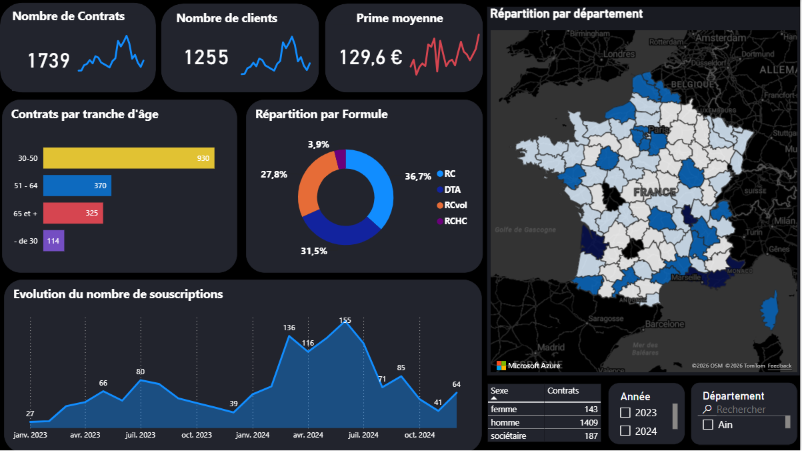

##  Objectifs du Projet

* **Analyse & Segmentation :** Identifier des pistes de solutions pour augmenter la part de marché sur le segment -30 ans. Démontrer le segment principal (tranche 30-50 ans) et analyser la répartition par formules de garanties.
* **Profil des clients :** Analyser le profil des clients selon leur sexe, leur profession, et leur usage des véhicules.  
* **Pilotage Commercial :** Suivre les indicateurs clés de performance (1 739 contrats, 1 255 clients, prime moyenne de 129,60 €).
* **Cartographie & Saisonnalité :** Visualiser la distribution géographique par département et observer l'évolution mensuelle des souscriptions.

## Stack Technique

* **Langage :** Python 3 13 7
* **Traitement & Analyse :** sql via `duckdb`
* **Visualisation & App :** `Power BI`
* **Contrôle de version :** Git

## Fonctionnalités & Insights du Tableau de Bord  
### Page 1 : Vue globale  
- **Pilotage de l'activité commerciale :** Suivi en temps réel des volumétries (1 739 contrats, 1 255 clients) et de la prime moyenne (129,60 €).
- **Segmentation comportementale :** Analyse fine des souscriptions par tranche d'âge (cœur de cible : 30–50 ans) et par formule de garanties (RC largement prédominante à 36,7 %).
- **Analyse temporelle & saisonnalité :** Mise en évidence des pics de souscription (notamment au printemps/été 2024).
- **Cartographie dynamique & Filtres :** Exploration géographique par département et filtres temporels multi-critères.
  
   
